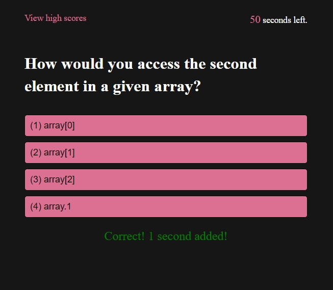

# Code Quizbowl

## Description

- A Start button to begin the timed multiple-choice quiz
- When a question is answered, the next question appears
- When a question is answered incorrectly, the timer is reduced
- When all questions are answered or the timer reaches 0, the game ends
- When the game ends, initials and high score can be saved

## Table of Contents

- [Installation](#installation)
- [Usage](#usage)
- [Credits](#credits)
- [License](#license)

## Installation

Clone the repository in a CLI using the command `git clone` to download all source files.

## Usage

Upload HTML source code and asset files to hosting service such as GitHub Pages.

The landing page is hosted [here](#).

## Credits

Developed from the ground up for the Vanderbilt Coding Boot Camp.

## License

Creative Commons Zero v1.0 Universal
